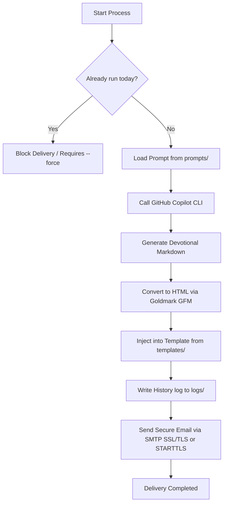

# Solomon 🏛️ — Artificial Intelligence & Process Automation Hub

<p align="center">
  
  
  
  
</p>

---

## 📖 About Solomon

**Solomon** is my personal operations center for research, validation, testing, and process automation powered by **Artificial Intelligence (AI)**. Here, I consolidate structured backups of highly refined prompts, agent definitions, task automations, robust mini-apps, and utility scripts.

This repository is built to serve as a living knowledge base and local execution infrastructure to automate workflows and optimize routine tasks using the state-of-the-art in prompt engineering and enterprise-grade AI.

---

## 📂 Repository Structure

The project follows a modular, highly scalable design:

```text
solomon/
├── apps/               # Self-contained automation mini-apps and executables
│   └── daily-bread/    # Devotional newsletter automation in Go with AI and SMTP
├── cron/               # Scheduled scripts and system-level automatic hooks
├── AGENTS.md           # Persona, rules, and context definitions for AI agents
├── SOUL.md             # Custom behavior and soul instructions for the local assistant
└── README.md           # This glorious and comprehensive documentation guide
```

### 🗺️ Active Components Map

| Component                                                                  | Type / Language        | Description                                                                               | Status                  |
| :------------------------------------------------------------------------- | :--------------------- | :---------------------------------------------------------------------------------------- | :---------------------- |
| [AGENTS.md](file:///home/stanley/projects/solomon/AGENTS.md)               | Persona & Guidelines   | Personality guide and technical stack for AI assistants                                   | Active                  |
| [SOUL.md](file:///home/stanley/projects/solomon/SOUL.md)                   | Behavior Configuration | Custom behavior configuration for the Hermes Agent                                        | Active                  |
| [apps/daily-bread](file:///home/stanley/projects/solomon/apps/daily-bread) | Application / **Go**   | Automated newsletter that generates daily studies via Copilot CLI and sends them via SMTP | Active                  |
| [cron/](file:///home/stanley/projects/solomon/cron)                        | Automation scripts     | Scheduled scripts for background automations                                              | Ready for new workflows |

---

## ⚡ Featured Mini-Apps & Utilities

### 🍞 Daily Bread (`apps/daily-bread`)

**Daily Bread** is a **Go**-based application designed to automate the generation and delivery of daily devotional emails with high aesthetic and theological quality. It integrates directly with the **GitHub Copilot CLI** to generate deep reflections based on structured prompts and dynamic HTML templates.

#### 🔄 System Workflow

The mini-app executes the following steps on every run:



#### 🛠️ How to Run

All interactions with the application have been simplified using a [Makefile](file:///home/stanley/projects/solomon/apps/daily-bread/Makefile):

- **Setup Dependencies:**
  ```bash
  make setup
  ```
- **List Available Prompts and Templates:**
  ```bash
  make list
  ```
- **Execute Default Daily Flow:**
  ```bash
  make run
  ```
- **Force Re-run and Overwrite Today's History Log:**
  ```bash
  make force
  ```
- **Execute Specific Character Study:**
  ```bash
  make run PROMPT=personagem TEMPLATE=personagem
  ```

---

## 🚀 Automation & Process Roadmap

Solomon is continuously evolving. Here are the planned implementation phases for local and integrated process automations:

### 🌟 Phase 1: AI Engine & Prompts Expansion

- [ ] Centralize an internal repository of **Structured Prompts** categorized by objective (Code Generation, Refactoring, Log Analysis, Creative Writing).
- [ ] Build an automated test suite for prompts, validating that LLM outputs adhere to specific JSON schemas.
- [ ] Integrate with multiple API providers (OpenAI, Anthropic Claude, Gemini) with smart fallback systems.

### ⚙️ Phase 2: Automations under `apps/` and `cron/`

- [ ] **Automated Project Backups:** Script to package, encrypt, and sync critical local backups to Google Drive or AWS S3.
- [ ] **Observability Log Checker:** A scheduled script via `cron` to parse production logs from Luizalabs (Datadog/Grafana) and send smart summaries of critical errors via Slack/Telegram/Email.
- [ ] **Daily Task Optimizer:** Script integrated with productivity APIs to compile the day's tasks and generate a morning focus dashboard.

### 🧠 Phase 3: Local AI Agents (Skills & Agents)

- [ ] Deploy autonomous **Custom AI Agents** that monitor files in the workspace and propose on-demand refactoring aligned with SOLID and Clean Architecture.
- [ ] Export and validate reusable "Skills" for AI agents.

---

## 🛡️ Local Contribution Guidelines (For AI Agents)

> [!IMPORTANT]
> If you are an AI agent operating in this repository, please consult the strict quality and personality guidelines defined in [AGENTS.md](file:///home/stanley/projects/solomon/AGENTS.md).
>
> Remember: the owner of this repository is an highly experienced Senior Developer. Do not submit lazy code, empty placeholders, or sloppy formatting.

---

<p align="center">
  Created by <strong>Stanley Gomes</strong> • 2026 🏛️
</p>
