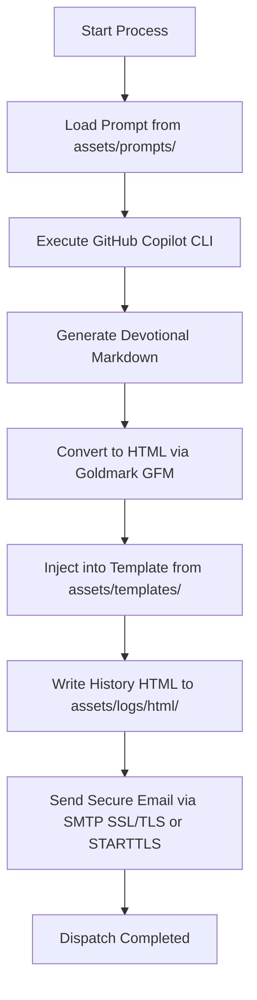

# 👑 Solomon - My AI & Automation Hub

## 📖 About Solomon

**Solomon** is my personal operations center for research, validation, testing, and process automation powered by **Artificial Intelligence (AI)**. Here, I consolidate structured backups of highly refined prompts, agent definitions, task automations, robust mini-apps, and utility scripts.

This repository is built to serve as a living knowledge base and local execution infrastructure to automate workflows and optimize routine tasks using the state-of-the-art in prompt engineering and enterprise-grade AI.

## 🏗️ Architecture

A lightweight, reliable, and state-persistent task coordinator written in **Go**.

This scheduler is specifically designed to solve task orchestration limits on personal computers (e.g., laptops) that do **not** run 24/7. Traditional cron engines fail if the computer is turned off during the scheduled hour. `solomon-cron` runs frequently (e.g., every 5 minutes) and uses a state lock file to ensure tasks run exactly once per day, hour, or customized time window—no matter when the system boots or sleeps.

---

## ⚡ Features

1. **State-Persistent Locks (`state.json`)**: Prevents tasks from double-executing. If a task is scheduled for `"daily"`, it will run exactly once per calendar day when the computer is online.
2. **Flexible & Intelligent Scheduling**:
   - `"daily"`: Runs once per calendar day (local time zone).
   - `"hourly"`: Runs once per calendar hour.
   - Custom Durations (Go's `time.Duration` parsing): e.g., `"12h"`, `"4h"`, `"45m"`. Executes if the time elapsed since the last run exceeds the specified duration.
3. **Daily Rotated Audit Logs**: Automatically writes execution summaries, stdout, and stderr to thread-safe files inside `cron/logs/YYYY-MM-DD.log`.
4. **Isolated Work Directories**: Each task can define its own working directory (`dir`) to resolve local scripts, assets, and env files appropriately.
5. **No External Dependencies**: Built entirely with the standard Go library for maximum efficiency and security.

---

## 📂 File Structure

```text
cron/
├── Makefile          # Automation shortcuts (build, run, clean, state reset)
├── README.md         # This manual
├── config.json       # Task definitions and schedules
├── go.mod            # Go module definition
├── state.json        # Execution tracking (git-ignored)
├── cmd/              # Executable entrypoint
│   └── solomon-cron/
│       └── main.go   # Entrypoint CLI assembler
├── internal/         # Private application logic (non-importable)
│   ├── config/       # Config structures & JSON loading logic
│   ├── logger/       # Thread-safe daily rotated log writer
│   ├── scheduler/    # Scheduling parser and command execution motor
│   └── state/        # Lock management & execution history serialization
└── logs/             # Central log repository (git-ignored)
    └── YYYY-MM-DD.log
```

---

## ⚙️ Configuration (`config.json`)

Tasks are configured in the `config.json` file.

```json
{
  "tasks": [
    {
      "id": "hello-test",
      "name": "Cron Scheduler Test Task",
      "command": "echo",
      "args": ["Hello from Solomon! The cron is alive and well."],
      "dir": "",
      "schedule": "hourly"
    },
    {
      "id": "daily-bread",
      "name": "Daily Bread Devotional Newsletter",
      "command": "internal:daily-bread",
      "args": ["-template", "daily_bread"],
      "dir": "",
      "schedule": "daily"
    }
  ]
}
```

### Properties:

- `id`: Unique identifier for state-tracking.
- `name`: Human-readable name for logging.
- `command`: Target executable or command (e.g., `./daily-bread`, `go`, `bash`).
- `args`: Array of command-line arguments.
- `dir`: Working directory relative to `cron/` or absolute path.
- `schedule`: `"daily"`, `"hourly"`, or durations like `"12h"`, `"30m"`.

---

## 🚀 Execution & Automation

All shortcuts are centralized in the [Makefile](file:///home/stanley/projects/solomon/cron/Makefile):

### 1. Compile the Binary

```bash
make build
```

This generates the optimized `solomon-cron` binary inside the `cron/` folder.

### 2. Manual Test Run

```bash
make run
```

Runs the coordinator in place to check conditions and execute tasks immediately.

### 3. Reset Scheduler State

If you want to bypass the daily lock and force all tasks to run on the next execution, run:

```bash
make reset-state
```

---

## 📅 System Integration (Setting Up your Local Cron)

To configure `solomon-cron` to execute every 5 minutes and handle all orchestration under the hood, open your user crontab:

```bash
crontab -e
```

And append the following entry (adjust paths to match your local setup):

```text
*/5 * * * * cd /home/stanley/projects/solomon/cron && ./solomon-cron > /dev/null 2>&1
```

With this, you will never miss a single newsletter dispatch or system maintenance routine again, even if you keep closing your laptop. 💅💀

---

## 🍞 Integrated Service: Daily Bread

**Daily Bread** is a Go-based automation newsletter now fully integrated as an **internal service** inside the `solomon-cron` coordinator. It automates the generation and delivery of daily devotional emails with high theological quality, directly calling the **GitHub Copilot CLI** to generate deep reflections. 🙄💅🤷‍♂️💀

### 🔄 System Workflow

When triggered by the scheduler or manual execution, the service performs the following steps:



### ⚙️ Configuration & Environment

The application requires a `.env` file in the root of the `cron/` directory. You can copy the template provided in [.env.example](file:///home/stanley/projects/solomon/cron/.env.example) to get started:

```ini
SMTP_HOST=your-smtp-host
SMTP_PORT=465 # Use 465 for SSL/TLS, or 587 for STARTTLS
SMTP_USER=your-smtp-username
SMTP_PASSWORD=your-smtp-password
SMTP_USE_TLS=true

EMAIL_FROM=Pão Diário <your-email@domain.com>
EMAIL_TO=recipient@domain.com
EMAIL_SUBJECT=Pão Diário - Edição de Hoje
```

#### Setup

Add the following entry to your local system `crontab -e`:

```text
*/5 * * * * cd /home/stanley/projects/solomon/cron && ./solomon-cron > /dev/null 2>&1
```

### 🛠️ Execution & Shortcuts

You can orchestrate and test the Daily Bread service using these shortcuts:

#### 1. List Available Prompts and Templates

Lists all configurable studies and templates currently residing inside your Go-recommended assets directories:

```bash
make list
```

#### 2. Run Daily Bread

Runs the newsletter generation and delivery:

```bash
make run-daily-bread
```

## 🤝 Como Contribuir

1. Fork o projeto
2. Crie uma branch para sua feature (`git checkout -b feature/AmazingFeature`)
3. Commit suas mudanças (`git commit -m 'Add some AmazingFeature'`)
4. Push para a branch (`git push origin feature/AmazingFeature`)
5. Abra um Pull Request

## 🔗 Links Úteis

- [Turborepo Docs](https://turborepo.dev/docs)
- [Next.js Docs](https://nextjs.org/docs)
- [Vercel](https://vercel.com)

Made with 🔥 by Lumen HQ
 Lumen HQ
