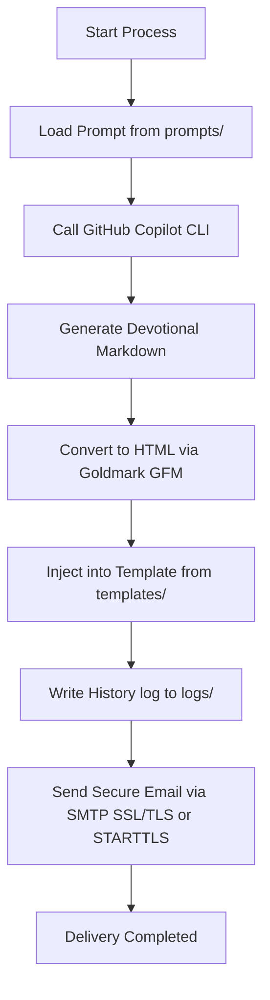

# 🍞 Daily Bread - Automation Newsletter

**Daily Bread** is a **Go**-based application designed to automate the generation and delivery of daily devotional emails with high aesthetic and theological quality. It integrates directly with the **GitHub Copilot CLI** to generate deep reflections based on structured prompts and dynamic HTML templates.

---

## 🔄 System Workflow

The mini-app executes the following steps on every run:



---

## ⚙️ Configuration & Environment

The application requires a `.env` file in the root of the app directory. You can copy the template provided in [.env.example](file:///home/stanley/projects/solomon/apps/daily-bread/.env.example) to get started.

Make sure to configure the following environment variables:

```ini
SMTP_HOST=your-smtp-host
SMTP_PORT=465 # Use 465 for SSL/TLS, or 587 for STARTTLS
SMTP_USER=your-smtp-username
SMTP_PASSWORD=your-smtp-password
SMTP_USE_TLS=true

EMAIL_FROM=Pão Diário <your-email@domain.com>
EMAIL_TO=recipient@domain.com
EMAIL_SUBJECT=Pão Diário - Edição de Hoje
```

---

## 🛠️ How to Run

All interactions with the application are simplified via the local [Makefile](file:///home/stanley/projects/solomon/apps/daily-bread/Makefile):

### 📥 1. Setup Dependencies
Initializes, downloads, and tidies up Go modules:
```bash
make setup
```

### 📋 2. List Available Prompts and Templates
Scans the local directories to show all selectable prompts and templates:
```bash
make list
```

### 🚀 3. Run Standard Flow
Runs the newsletter generation and delivery with the default `devocional` template (which automatically resolves `prompts/devocional.md` and `templates/devocional.html`):
```bash
make run
```


### 🎯 5. Custom Devotionals
Runs the flow with a custom template (which automatically resolves the prompt of the same name):
```bash
make run TEMPLATE=personagem
```

---

## 📂 Project Structure

- `prompts/`: Contains structured markdown prompts used to instruct the AI agent.
- `templates/`: Contains HTML layout templates utilizing the `{{date}}` and `{{content}}` dynamic placeholders.
- `logs/`: Centralizes all execution output and historical archives:
  - `logs/html/`: Stores the compiled daily HTML emails (`YYYY-MM-DD.html`).
  - `logs/logs/`: Stores the daily execution stdout/stderr logs (`YYYY-MM-DD.log`).
